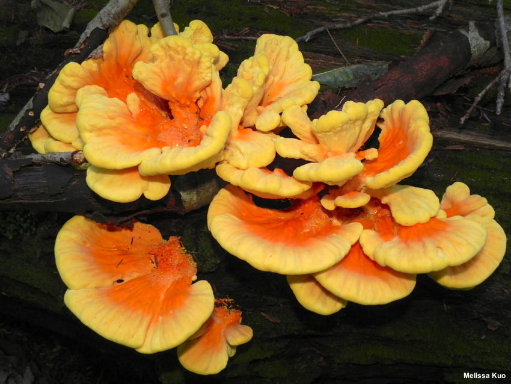
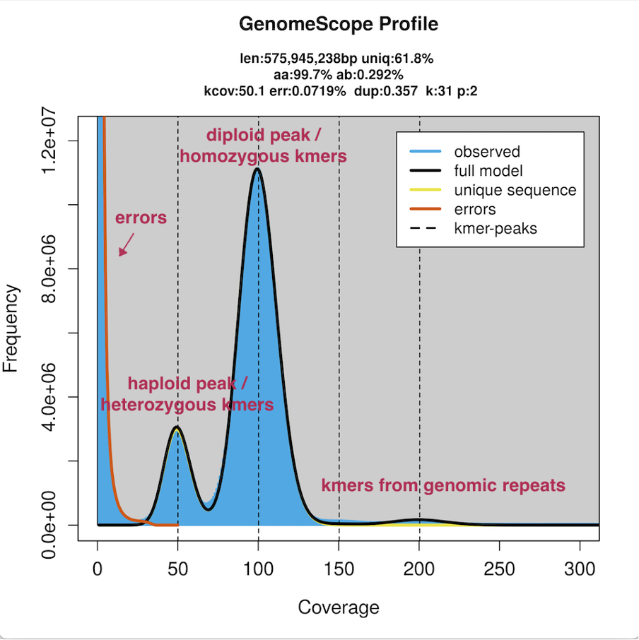
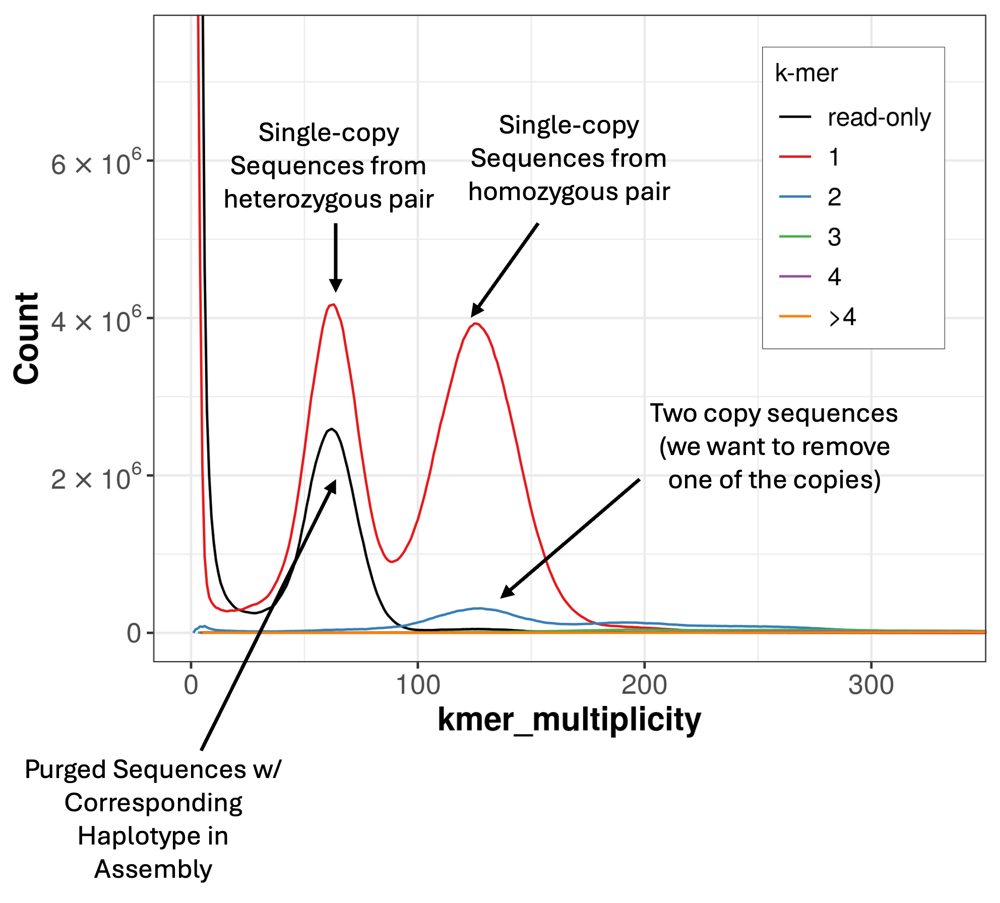

# Basic Long Read Assembly Tutorial
## An example using PacBio HiFi Reads and Arima HiC

### Contents


#### 1. Introduction
This tutorial provides a step by step guide on how to go from trimmed PacBio HiFi 
and raw Arima HiC reads to a basic scaffolded the assembly using adapted from a 
version of the assembly pipeline used by the Sanger Tree of Life Assembly Team.

The data provided is a subset Chicken of the Woods 
(_Laetiporus sulphureus_) reads sequenced as part of the Wellcome Sanger Institute's Darwin 
Tree of Life Program ([PRJEB47319](https://www.ncbi.nlm.nih.gov/bioproject/760425)). The 
[Tree of Life ID[https://id.tol.sanger.ac.uk/] (ToLID) for the sequenced sample is 
**gfLaeSulp1** which is how we will be referring to this sample from here onwards.




#### 2. Initializing the GitPod environment
First, we'll set our GitPod preferences so that our GitPod environment doesnt time out every 30 minutes.

Go to https://gitpod.io/user/preferences. Set the 'Timeouts' field to the max time (24h).


Next, lets open up our GitPod environment. Go to the 
[BGA Genome Assembly GithHub site](https://github.com/thebgacademy/genomeassembly).

On the GitHub page, select **Open in GitPod**.


Once your environment loads, you should see a message in the bottom right hand corner fo your workspace 
associated with Port 6080. Click on **'Open Browser'**.


This will open a Graphical User Interface (GUI) that mirrors your command line environment. 
While we will be running most things via the command line the GUI can be useful for looking at graphs we 
create as part of the pipeline.

**Note: If this message disappears you can access Port 6080 in the PORTS tab on the main GitPod page.**


Let's create a working directory and set a variable for it. We'll also store our sample name in a variable

```bash
outdir=/workspace/assembly
mkdir -p $outdir
cd $outdir

sample=gfLaeSulp1
```

Let's also symlink our pre-trimmed PacBio read data to our working directory and create a variable shortcut.

```bash
reads=/workspace/assembly/$sample.pacbio.fa.gz
ln -fs /workspace/data/$sample.pacbio.fa.gz $outdir/
```

#### 3. Long Read QC
In this section we will begin by taking a look at our trimmed long read data 
(`/workspace/data/gfLaeSulp1.pacbio.fa.gz`) to check if it matches our expectations for
ploidy, genome size, etc.

We'll start by looking counting kmers with [**FastK**](https://github.com/thegenemyers/FASTK)

>**FastK** counts the number of k‑mers in a corpus of DNA sequences over the alphabet 
>{a,c,g,t} for a specified k‑mer size, 40 by default.

```bash
mkdir -p $outdir/genomescope/tmp
cd $outdir/genomescope
FastK \
	-k31 \
	-T8 \
	-t1 \
	-Ptmp \
	-N$sample.k31 \
	$reads
```

We'll use **Histex** (part of the FastK suite) to convert the file `gfLaeSulp1.hist` 
produced by FastK into a text file format usable by 
[**GeneScope.FK**](https://github.com/thegenemyers/GENESCOPE.FK), an adaptation of 
[**GenomeScope**](https://github.com/schatzlab/genomescope).

```bash
Histex \
	-h1:32767 \
	-G \
	$sample.k31 \
	| tee k31.hist.txt \
	| GeneScopeFK.R \
		-o . \
		-n $sample.k31 \
		-k31
```

- Take a look at the outputs of GenomeScope in the GUI. What is our coverage? Does the model that GenomeScope produce match our data reasonably well. If so, what can we expect our assembly size to be?




Now produce a plot comparing GC content and coverage using **KatGC** 
(part of the [MERQURY.FK suite](https://github.com/thegenemyers/MERQURY.FK))

```bash
KatGC \
	-T8 \
	$sample.k31 \
	$sample.k31_gc
```

If KatGC doesn't work....
```bash
cd $outdir/genomescope
wget http://asg.cog.sanger.ac.uk/s2g/$sample.k31_gc.fi.png
wget http://asg.cog.sanger.ac.uk/s2g/$sample.k31_gc.ln.png
wget http://asg.cog.sanger.ac.uk/s2g/$sample.k31_gc.st.png
```


Take a look at the outputs of KatGC. Do the high density peaks in our GC plot match those in the 
GenomeScope plot? Does it look like we have sequences from other organisms in our sample at significant 
coverage (>5)?

We'll compare kmer pairs as a way of assessing ploidy. The previous plots already indicate
this sample is likely diploid but kmer distributions alone can sometimes be deceptive. It
is always a good idea to check using a tool like **SmudgePlot** (or PloidyPlot here) that
compares ratios of kmer pairs.

```bash
PloidyPlot \
	-T8 \
	-Ptmp \
	-kv \
	-o$sample.k31_ploidy \
	$sample.k31 \
	2>k31_ploidy.log
```

If PloidyPlot doesn't work....
```bash
cd $outdir/genomescope
wget http://asg.cog.sanger.ac.uk/s2g/$sample.k31_ploidy.fi.png
wget http://asg.cog.sanger.ac.uk/s2g/$sample.k31_ploidy.ln.png
```


Take a look at the smudgeplot you just created. Again check to see if it matches your expectations and 
the other plots you've created.

#### 4. HiFiasm Assembly and QC
Now that we have taken a look at our reads and noted that everything looks okay we can 
proceed with assembly. While there are many different assemblying algorithms, the Sanger 
Tree of Life team has found that **HiFiasm** consistently produces the best results.

Running HiFiasm can require lots of computational resources and time. Because we are limited
on both we will **_skip running HiFiasm_** but the command is given below for reference.

```bash
cd /$outdir
hifiasm \
	-t 8 \
	-o $sample \				
	--primary \
	$reads
```

**Note: We could've provided our HiC data as input to HiFiasm to produce phased-assemblies 
rather than a primary and alternate but chose to go for the latter in order to keep our
pipeline as simple as possible**

The HiFiasm data provided in the directory `/workspace/data/hifiasm_output`.
Let's link those files to our working directory.

```bash
ln -fs /workspace/data/assembly_files/* $outdir/
```

Take a look at the contents of your directory now using the `ls` command.

HiFiasm is a graph-based assembly and outputs assemblies in `gfa` format.


Let's convert our primary and alternate assemblies from `gfa` to `fasta` format using a 
simple `awk` command

```bash
awk '/^S/{print ">"$2"\n"$3}' $outdir/$sample.p_ctg.gfa \
	| fold \
	> $outdir/$sample.p_ctg.fa
awk '/^S/{print ">"$2"\n"$3}' $outdir/$sample.a_ctg.gfa \
	| fold \
	> $outdir/$sample.a_ctg.fa
```

Use [**gfastats**](https://github.com/vgl-hub/gfastats) to get summary statistics for our
primary and alternate assemblies


```bash
gfastats \
	$outdir/$sample.p_ctg.fa \
	> $outdir/$sample.p_ctg.fa.stats
gfastats \
	$outdir/$sample.a_ctg.fa \
	> $outdir/$sample.a_ctg.fa.stats
```


Take a look at the primary stats...

- Does the assembly size match what was expected based on our GenomeScope model?
- What is the N50? What is the maximum contig length? How many contigs are there?

Take a look at the alternate stats...

- Do these match the primary? Why do you think the stats are 'worse'?

Next, let's take a look at kmer density plots associated with this assembly 
using [**MERQURY.FK**](https://github.com/thegenemyers/MERQURY.FK). For this, we can reuse
the kmer counts generated by FastK.


```bash
mkdir -p $outdir/$sample.p_ctg.ccs.merquryk
cd $outdir/$sample.p_ctg.ccs.merquryk
docker run -v /workspace:/home/docker ng130/fastk-suite MerquryFK -T6 assembly/genomescope/$sample.k31 assembly/$sample.p_ctg.fa assembly/$sample.a_ctg.fa $sample.ccs
```

If MerquryFK doesn't work....
```bash
cd $outdir
wget http://asg.cog.sanger.ac.uk/s2g/$sample.p_ctg.ccs.merquryk.tar.gz
tar -zxvf $outdir/purging/$sample.p_ctg.ccs.merquryk.tar.gz
```

- Take a look at the outputs. Do you see any retained haplotypic duplication that needs to be purged? Refer to the example below.




Now lets run BUSCO to get a sense of overall completeness and haplotypic duplication.

```bash
cd $outdir
busco \
	--metaeuk \
	--tar \
	--in $outdir/$sample.p_ctg.fa \
	--cpu 8 \
	--out $sample.p_ctg.basidiomycota_odb10.busco \
	--mode genome \
	--lineage_dataset basidiomycota_odb10
```

BUSCOs are a set of genes expected to occur as a single copy in all members of a given taxon.

The percent total complete BUSCOs gives a us an idea of how complete our assembly is.

The percent duplicated BUSCOs can give us an indication of whether we have any haplotypic duplication
we might need to purge.

**NOTE: Not all BUSCO databases are created equal. These databases are biased by the types of organisms**
**that were studied when creating them and so BUSCO outputs should be considered in context. For example,**
**complete sponge genomes rarely have BUSCO completenesses > 80% using the metazoan database. Similarly,** 
**I have had difficulty getting dinoflagellate duplication percentages less than 15%.**

**In the case of this mushroom, however, we don't need to worry much about this**

#### 5. Purging Duplicates
The BUSCO scores and the MERQURY plots both suggest that our primary assembly contains
signficant amounts of retained haplotypic duplication that we would like to remove. To
do this we will use a program called [**purge_dups**](https://github.com/dfguan/purge_dups).

**Determine coverage cutoffs**

purge_dups relies on coverage cutoffs to determine which detected duplicates may, in fact,
be true haplotypic duplications (hap dups) we want to remove. Incorrect cutoffs can result 
in _underpurging_ (not removing true hap dups) or _overpurging_ (removing genomic 
sequences that are not true hap dups).

To start, we map the reads back to the assembly using 
[**Minimap2**](https://github.com/lh3/minimap2).

```bash
mkdir -p $outdir/purging/coverage
minimap2 \
	-t 8 \
	-x map-pb \
	$outdir/$sample.p_ctg.fa \
	$reads \
	| gzip -c - \
	> $outdir/purging/coverage/$sample.paf.gz \
```

We use the alignment as input for purge_dups to automatically calculate purging cutoffs.

```bash
pbcstat \
	$outdir/purging/coverage/$sample.paf.gz
calcuts \
	$outdir/purging/coverage/PB.stat \
	> $outdir/purging/coverage/cutoffs
hist_plot.py -c \
	$outdir/purging/coverage/cutoffs \
	$outdir/purging/coverage/PB.stat \
	$outdir/purging/coverage/cutoffs.png
```


**Purging**

For the actual purging step, we need to identify potential hap dups. We do this by
aligning the assembly to itself

```bash
split_fa \
	$outdir/$sample.p_ctg.fa \
	> $outdir/$sample.p_ctg.fa.split	
minimap2 \
	-t8 \
	-xasm5 \
	-DP \
	$outdir/$sample.p_ctg.fa.split \
	$outdir/$sample.p_ctg.fa.split \
	> $outdir/purging/coverage/$sample.split.self.paf
```

We then use purge_dups to identify potentially duplicated regions.

```bash
mkdir $outdir/purging/purge_dups
purge_dups \
	-2 \
	-T $outdir/purging/coverage/cutoffs \
	-c $outdir/purging/coverage/PB.base.cov \
	$outdir/purging/coverage/$sample.split.self.paf \
	> $outdir/purging/purge_dups/dups.bed	
```

And finally separate out the sequences.

```bash
get_seqs -e \
	$outdir/purging/purge_dups/dups.bed \
	$outdir/$sample.p_ctg.fa \
	-p $outdir/purging/$sample
```

As with the HiFiasm assembly step, the output is a primary purged assembly and sequences
that were removed. Along with the alternate assembly from the assembly step, we can treat
these reads as part of a larger alternate assembly.


```bash
cat $outdir/$sample.a_ctg.fa \
	$outdir/purging/$sample.hap.fa \
	> $outdir/purging/$sample.hap.all.fa
```

We now calculate assembly stats to ensure that we have not overpurged or underpurged and
that our assembly looks better than before.

```bash
cd $outdir/purging
gfastats \
	$outdir/purging/$sample.purged.fa \
	> $outdir/purging/$sample.purged.fa.stats
gfastats \
	$outdir/purging/$sample.hap.all.fa \
	> $outdir/purging/$sample.hap.all.fa.stats
mkdir -p $outdir/$sample.purged.ccs.merquryk
docker run -v /workspace:/home/docker ng130/fastk-suite MerquryFK -T6 assembly/genomescope/$sample.k31 assembly/purging/$sample.purged.fa assembly/purging/$sample.hap.all.fa $sample.ccs
docker run -v /workspace:/home/docker ezlabgva/busco:v5.7.1_cv1 --metaeuk --force --tar --in assembly/scaffolding/yahs/out.break.yahs/out_scaffolds_final.fa  --cpu 8 --out out_scaffolds_final.basidiomycota_odb10.busco --mode genome --lineage_dataset basidiomycota_odb10 

busco \
	--metaeuk \
	--force \
	--tar \
	--in $outdir/purging/$sample.purged.fa \
	--cpu 8 \
	--out purged.basidiomycota_odb10.busco \
	--mode genome \
	--lineage_dataset basidiomycota_odb10
```

If MerquryFK doesn't work....
```bash
cd $outdir/purging
wget http://asg.cog.sanger.ac.uk/s2g/$sample.purged.ccs.merquryk.tar.gz
tar -zxvf $outdir/purging/$sample.purged.ccs.merquryk.tar.gz
```

- Based on our Merqury plots and BUSCO outputs, have we managed to remove most of the haplotypic duplication?

- Have we overpurged at all (removed unique sequences)?


#### 6. Scaffolding
Scaffolding is the process of placing contigs together that appear to come from the same
sequence (e.g. chromosome) using external evidence. For this tutorial, we are using HiC
data. These are short paired reads (Illumina) that for which each read can come from very
distant parts of a chromosome. Reads from a given pair mapping to different contigs provide 
evidence that those contigs are from the same chromosome. Additionally, the probability of
getting pair of a reads with a given gap size between them should vary with the size of
gap (i.e. pairs from more distant parts of a chromosome are less likely than pairs that
are from regions of a chromosome that are closer together).


** HiC Alignment **

To scaffold with HiC reads, we first need to align them to our assembly. We will do this
using [**bwa-mem2**](https://github.com/bwa-mem2/bwa-mem2).

Before aligning, we need to index our assembly.

```bash
samtools faidx \
	$outdir/purging/$sample.purged.fa
bwa-mem2 index \
	$outdir/purging/$sample.purged.fa
```

**Note: To save time and due to resource restrictions, the output for the following alignment 
steps have already been generated. You can download it to your working folder.**
---

```bash
mkdir -p $outdir/scaffolding
cd $outdir/scaffolding
ln -fs /workspace/data/$sample.mkdup.bed.gz $outdir/scaffolding
```

```bash
mkdir -p $outdir/scaffolding
cd $outdir/scaffolding
wget http://asg.cog.sanger.ac.uk/s2g/$sample.mkdup.bed.gz
wget http://asg.cog.sanger.ac.uk/s2g/$sample.mkdup.bam.stats
```
---

Let's download our HiC data.

```bash
cd $outdir
wget http://asg.cog.sanger.ac.uk/s2g/gfLaeSulp1.hic.cram
hic_cram=$outdir/$sample.hic.cram
```


Now we can begin the alignment process. Because alignment files can be relatively large
we will run our data through multiple steps in succession without saving intermediate
data. These steps are...

- Coverting cram file to fastq
- Aligning the reads to the assembly
- Fix mate information (including adding insert size information)
- Coordinate sort the alignments


First, we'll preserve some of the read group info in our raw HiC cram file.

```bash
samtools view -H $hic_cram \
	> $outdir/scaffolding/head.tmp
while read line 
do
	if `echo $line | grep -q $'^@RG'`
	then
		rg_lines="$rg_lines -H '$line'"
	fi
done < head.tmp
rm $outdir/scaffolding/head.tmp
```


```bash
samtools view \
	-u $hic_cram \
	| samtools fastq \
		-F0xB00 \
		-nt \
		- \
	| bwa-mem2 mem \
		-t8 \
		-5 \
		-S \
		-P \
		-C \
		-p \
		$rg_lines \
		$outdir/purging/$sample.purged.fa - \
	| samtools fixmate \
		-m \
		-p \
		-u \
		- - \
	| samtools sort \
		--write-index \
		-l1 \
		-@8 \
		-T $outdir/scaffolding/$sample.sort.tmp \
		-o $outdir/scaffolding/$sample.bam \
		- 	
```


Next, we want to mark any potential duplicate reads so they don't bias downstream analyses.
These reads are technical duplicates that can be generated by over-amplifying a specific
read during a PCR step (PCR duplicates) or can result from overclustering-related flow cell issues during
issues that occur during sequencing (optical duplicates).

```bash
samtools markdup \
	--write-index \
	-c \
	-@8 \
	-T $outfile.mkdup.tmp \
	-f $outfile.metrics.txt \
	$outdir/scaffolding/$sample.bam \
	$outdir/scaffolding/$sample.mkdup.bam
```

We now want to QC our alignments to make sure everything is looking okay

```bash
samtools stats \
	-@8 \
	-F0xB00 \
	$outdir/scaffolding/$sample.mkdup.bam \
	> $outdir/scaffolding/$sample.mkdup.bam.stats
```

- What percent of our reads have mapped properly to the assembly?


Finally, we do another quality filter alignments and convert our data from **bam** to 
**bed** format.

```bash
samtools view \
	-@8 \							
	-u \
	-F0xf00 \
	-e 'mapq>=10' \
	$outdir/scaffolding/$sample.mkdup.bam \
	| bedtools bamtobed \
	| LC_ALL=C sort \
		-k4,4 \
		-T $outdir \
		--parallel=8 \
		-S50G \
		> $outdir/scaffolding/$sample.mkdup.bed
```
---

We are ready to scaffold!

**Scaffolding**

As with assembly and alignment, there are many tools available to scaffold contigs.
At Tree of Life, we've found that [**YaHS**](https://github.com/c-zhou/yahs) typically 
provides the best outcomes.

```bash
mkdir -p $outdir/scaffolding/yahs/out.break.yahs
yahs \
	-o $outdir/scaffolding/yahs/out.break.yahs/out \
	$outdir/purging/$sample.purged.fa \
	$outdir/scaffolding/$sample.mkdup.bed.gz
```

If YaHS doesn't work....
```bash
cd $outdir/scaffolding/yahs/out.break.yahs
wget http://asg.cog.sanger.ac.uk/s2g/out_scaffolds_final.fa
wget http://asg.cog.sanger.ac.uk/s2g/out_scaffolds_final.agp
```


This will produce our scaffolded assembly along with an 
[**AGP**](https://www.ncbi.nlm.nih.gov/genbank/genome_agp_specification/) file 
documenting any breaks or joins in the assembly. 

Outputs will be in `$outdir/scaffolding/yahs/out.break.yahs`

Let's start by taking a look at our assembly.

```bash
gfastats \
	$outdir/scaffolding/yahs/out.break.yahs/out_scaffolds_final.fa \
	> $outdir/scaffolding/yahs/out.break.yahs/out_scaffolds_final.fa.stats
```

```bash
mkdir -p $outdir/scaffolding/yahs/out.break.yahs/out_scaffolds_final.ccs.merquryk
docker run -v /workspace:/home/docker ng130/fastk-suite MerquryFK -T6 assembly/genomescope/$sample.k31 assembly/scaffolding/yahs/out.break.yahs/out_scaffolds_final.fa assembly/purging/$sample.hap.all.fa $sample.ccs
```

If MerquryFK doesn't work....
```bash
cd $outdir/scaffolding/yahs/out.break.yahs
wget http://asg.cog.sanger.ac.uk/s2g/out_scaffolds_final.ccs.merquryk.tar.gz
tar -zxvf $outdir/scaffolding/yahs/out.break.yahs/out_scaffolds_final.ccs.merquryk.tar.gz
```


```bash
busco \
	--metaeuk \
	--force \
	--tar \
	--in $outdir/scaffolding/yahs/out.break.yahs/out_scaffolds_final.fa \
	--cpu 8 \
	--out out_scaffolds_final.basidiomycota_odb10.busco \
	--mode genome \
	--lineage_dataset basidiomycota_odb10
``

How does our scaffolded assembly compare with our purged and raw assemblies? What stats
have changed and what stats have not?

Scaffolding is not a fool-proof process and can result in the mis-joining of contigs
or it may miss clear locations where contigs should be joined. Visual inspection of the
HiC aligments can allow us to spot any of these potential errors.

For this step, we will convert our alignments into pretext maps, the format our curation
team commonly uses to view and clean up assemblies

**Note: Don't get bogged down in the details of these commands as we are largely just
manipulating the output data from YaHS.

```bash
cd $outdir/scaffolding/yahs/out.break.yahs
samtools faidx \
	$outdir/scaffolding/yahs/out.break.yahs/out_scaffolds_final.fa
cut \
	-f1-2 \
	$outdir/scaffolding/yahs/out.break.yahs/out_scaffolds_final.fa.fai \
	> $outdir/scaffolding/yahs/out.break.yahs/out_scaffolds_final.fa.chrom.sizes
juicer pre \
	$outdir/scaffolding/yahs/out.break.yahs/out.bin \
	$outdir/scaffolding/yahs/out.break.yahs/out_scaffolds_final.agp \
	$outdir/purging/$sample.purged.fa.fai \
	| LC_ALL=C sort \
		-k2,2d \
		-k6,6d \
		-T $outdir/scaffolding/yahs/out.break.yahs/out.break.yahs \
		--parallel=8 \
		-S15G \
	| awk '$3>=0 && $7>=0' \
		> $outdir/scaffolding/yahs/out.break.yahs/alignments_sorted.txt
docker run rnakato/juicer \
	pre \
		$outdir/scaffolding/yahs/out.break.yahs/alignments_sorted.txt \
		$outdir/scaffolding/yahs/out.break.yahs/yahs_scaffolds.hic \
		$outdir/scaffolding/yahs/out.break.yahs/out_scaffolds_final.fa.chrom.sizes
awk 'BEGIN{print "## pairs format v1.0"}{print "#chromsize:\t"$1"\t"$2}END{print "#columns:\treadID\tchr1\tpos1\tchr2\tpos2\tstrand1\tstrand2"}' $outdir/scaffolding/yahs/out.break.yahs/out_scaffolds_final.fa.fai \
	> $outdir/scaffolding/yahs/out.break.yahs/premap_input.txt
awk '{print ".\t"$2"\t"$3"\t"$6"\t"$7"\t.\t."}' $outdir/scaffolding/yahs/out.break.yahs/alignments_sorted.txt \
	>> $outdir/scaffolding/yahs/out.break.yahs/premap_input.txt
cat $outdir/scaffolding/yahs/out.break.yahs/premap_input.txt \
	| PretextMap \
		-o $outdir/scaffolding/yahs/out.break.yahs/yahs_scaffolds.pretext
```

Now that we have our pretext file, we can covert it into a png.

```bash
PretextSnapshot \
	-m $outdir/scaffolding/yahs/out.break.yahs/yahs_scaffolds.pretext \
	--sequences "=full"
```

Let's also take a look at our pretext file directly. In your GUI, open PretextView and load your pretext.